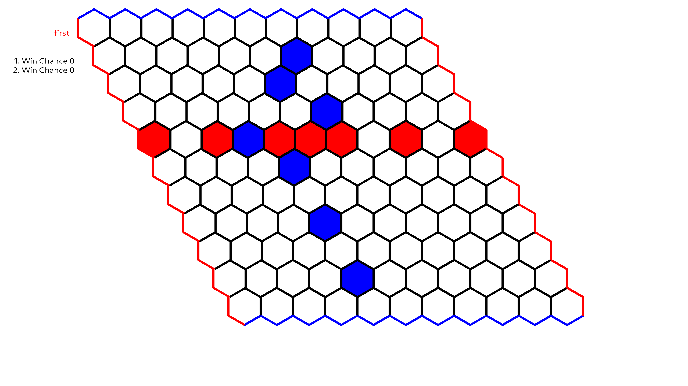

# HexGame – Strategisches Brettspiel in Java

Ein grafisch und strategisch anspruchsvolles Brettspiel mit KI-Gegnern, entwickelt in Java. Dieses Projekt implementiert das klassische Spiel **Hex** mit verschiedenen KI-Stufen und nutzt die leistungsfähige **IgelEngine** für die Benutzeroberfläche mit OpenGL.

## 🔧 Features

- ✅ Klassisches Hex-Brettspiel (beliebige Brettgröße möglich)
- 🧠 Mehrere KI-Gegner mit anpassbarer Spielstärke
- 🧑‍💻 Spieler gegen Spieler oder Spieler gegen KI
- 🖥️ Benutzeroberfläche mit OpenGL (IgelEngine)
- ⚙️ Plattformunabhängiger Build mit Gradle

## 📦 Voraussetzungen

- Java 21 oder höher
- Gradle (lokal installiert oder Wrapper im Projekt enthalten)
- OpenGL-fähige Umgebung

## 🚀 Projekt ausführen

1. Repository klonen:

   ```bash
   git clone --recursive https://github.com/GYP-Info-LK-24-26/HexGame.git
   cd HexGame
   ```

2. Projekt mit Gradle bauen und starten:

   ```bash
   ./gradlew run
   ```

   Oder bei installiertem Gradle:

   ```bash
   gradle run
   ```

## 🕹️ Spielanleitung

- **Ziel:** Verbinde gegenüberliegende Seiten des Bretts mit einer ununterbrochenen Linie deiner Spielsteine.
- Spieler 1 verbindet **links ↔ rechts**, Spieler 2 **oben ↔ unten**.
- Nach dem ersten Zug darf Spieler 2 die Seiten tauschen, wenn er möchte.
- Spiele gegen einen menschlichen Gegner oder wähle aus mehreren KI-Gegnern mit anpassbarer Schwierigkeit.
- Steuerung erfolgt intuitiv über Maus und grafische Benutzeroberfläche (IgelEngine mit OpenGL).

## 🤖 KI-Gegner

- Verschiedene Strategien wie:
    - Zufallszüge
    - Minimax mit Alpha-Beta-Pruning
    - Monte Carlo Tree Search (MCTS)
- Schwierigkeitsgrad individuell einstellbar
- Vergleich von KI-Spielern untereinander möglich

## 🛠️ Entwicklung

### Build-Tasks

- `./gradlew build` – kompiliert das Projekt
- `./gradlew run` – startet das Spiel
- `./gradlew test` – führt Tests aus (falls vorhanden)

### Ordnerstruktur

```
├── algorithm/
│   └── src/java             # Algorithm source
│
├── logic/
│   ├── src/java             # Logic source
│   └── build/docs           # java docs for logic
│
├── nn/
│   └── src/java             # AI source
│
├── ui/
│   ├── src
│   │   ├── java             # UI source
│   │   └── resources        # data files for UI(build info/textures)
│   │
│   └── IgelEngine
│       ├── build/docs       # java docs for IgelEngine
│       └── src
│           ├── java             # IgelEngine source
│           └── resources        # data files for IgelEngine(fonts/shaders)
└── README.md
```

## 📸 Screenshots



## 📄 Lizenz

Dieses Projekt steht unter der MIT-Lizenz – siehe [LICENSE](./LICENSE) für Details.

## 🙋‍♂️ Mitwirken

Pull Requests und Bug Reports sind herzlich willkommen!

---

> Entwickelt mit ☕, 🎲 und OpenGL.
